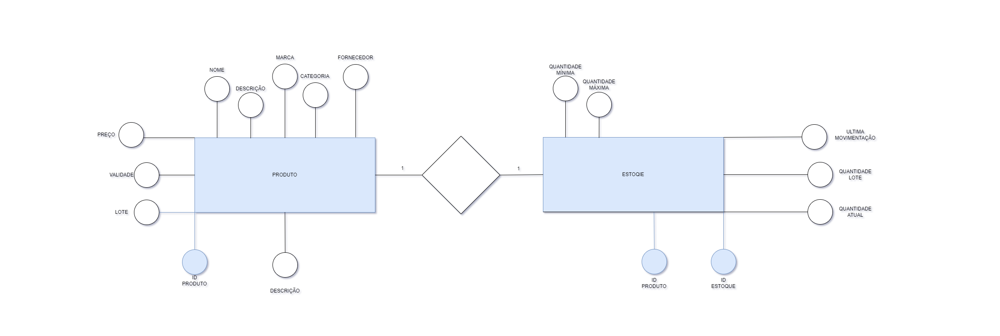
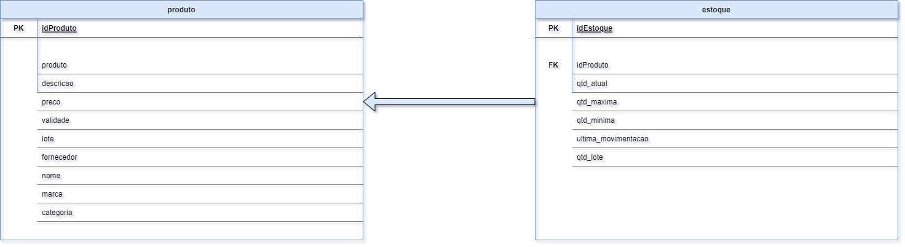
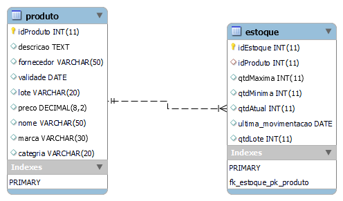

# Estudo de caso

## Casa Oliveira
Roberto é dono de um mercado no bairro de Vargem Grande, na cidade de Tupã. Ele herdou o negócio de seu pai, Gumercindo Oliveira, ela foi aberta em 1978 na garagem da casa da família, era uma pequena quitanda. Com o passar dos anos o negócio cresceu e Gumercindo foi obrigado a ir para outro ponto maior e ali permaneceu até os dias atuais.

Roberto, que agora é o novo dono do mercado continuou o negócio seguindo da mesma forma que o pai. Ele comprava diretamente com os fornecedores grandes volumes de produtos e armazenava em seu estoque. As vezes ele comprava muitos produtos que ainda havia em estoque causando uma sobrecarga de produtos, ele também tinha muitos produtos estragados, tais como: frutas, legumes, iogurtes, leites, frango, etc. Também havia muitos produtos com o prazo de validade vencido.

Os funcionários eram poucos e faziam muitas coisas ao mesmo tempo. O açougueiro também ajudava no estoque, a moça da limpeza ajudava na organização dos produtos das prateleiras, além de ajudar na padaria, quanto o caixa estava vazio o operador ajudava a repor os laticínios e a limpar a loja. O repositor também fazia operação no caixa.

Ao realizar a venda o Roberto, que sabia o nome de quase todos os clientes, anotava em um caderno todos os produtos que vendia e que havia em estoque. Ao fim do dia , Roberto pegava o caderno de fazia os cálculos de o quanto havia vendido, somando o faturamento e realizando a atualização do estoque. Isso é feito todos os dias e toma um tempo considerável para que tudo seja feito.

Roberto fechava a loja as 18h, mas só ia para casa as 22h, após fazer todas as operações necessárias. Mesmo assim o negócio vai bem e Roberto pretende ir para outro ponto e aumentar o volume de negócios e contratar novos funcionários.

Marica, esposa de Roberto, vem conversando com ele há muito tempo para que ele contrate uma empresa para construir um sistema de informática para gerenciar o negócio e reduzir o tempo que ele passa trabalhando e tenha maior organização dos produtos, maior lucratividade e melhorar a gestão.

Com a intenção de aumentar o negócio, Roberto está disposto a informatizar sua empresa. Vamos ajudá-lo. Iremos começar construindo o banco de dados.

# MODELAGEM CONCEITUAL
## Henrique Santos – Estudo de caso, Roberto.

### PROBLEMAS A SE SOLUCIONAR
•	Gerenciamento de estoque;
•	Falta de funcionários;
•	Funcionários desempenhando várias funções;
•	Fluxo de caixa (Entrada de valores | saída de valores);
•	Gestão do patrimônio (Computadores, prateleiras, geladeiras, fogão, carrinhos, caixas, balcões, padaria, açougue, balanças, etc.);
•	Setor de compras;
•	Setor financeiro;

### Gestão do estoque

•	Informações sobre os produtos (validade, preco, lote, nome, descricao, marca, idproduto, categoria, fornecedor);

•	Volume de produtos em estoque (quantidade_atual, quantidade_lote, ultima_movimentacao, quantidade_minima, quantidade_maxima, idproduto);

### Funcionário

•	Informações (nome, funcao | cargo, salario, matricula, cpf, rg, telefone, email, estado_civil, admissao, data nascimento, endereco, usuario, senha, idfuncionario);

### Fluxo de caixa

•	forma_pagamento, limite_sangria, valor (Entrada | Saída), registro_venda;

### Gestão de patrimônio

•	Informação patrimônio (idpatrimonio, codigopatrimonio, valorpatrimonio, nome, decricao, setor_pertencente, data_aquisicao, setor_responsavel, data_baixa);

### Setor de compras

•	Informação compras (idcompra, funcionario, valor_pag_produto, fornecedor, data_compra, numero_nota_fiscal, nome_produto, descricao, consumivel, quantidade, setor_destino);

### Setor financeiro

•	Informação financeiro (idfinanceiro, despesas, lucro, disponibilidade_cofre, valor, tipo_valor, descricao, data_operacao, identficacao_responsavel);

# MODELO CONCEITUAL

https://drive.google.com/file/d/1A5nfjsi9rKib3gqFu358jS-_sYdz97zr/view?usp=sharing


# MODELO LÓGICO

https://drive.google.com/file/d/1h4OfDsoyJ0Wty4AnYiUPnYUkDsmUr5E9/view?usp=sharing


# MODELO FÍSICO
### Código e documentação do modelo físico
```
/*
Para o projeto de banco de dados da casa oliveira, será criado, uma estrutura física com os comandos SQL(Structure Query Language).
Iremos começar com o comando de criação de banco de dados. Este comando pertence a categoria de comandos DDL(Data definition Language).
Comando:
	CREATE DATABASE nome_do_banco -> CREATE DATABASE casaoliveira
*/
```
```
CREATE DATABASE casaoliveira;
```
```
/*
Após a criação do banco de dados é necessário selecioná-lo. Para isso iremos usar o comando:
USE nome_do_banco
*/ 
```
```
USE casaoliveira;
```
```
/*
Criação das entidades em modo físico usando os comandos SQL. Para criar uma tabela(entidade), usaremos o comando:
CREATE TABLE nome_tabela seguido por parenteses e os atributos(campos) da tabela, bem como, a sua tipificação, 
ou seja, devemos dizer qual tipo de dado que cada campo(atributo) da tabela deve receber, EX.:
o campo idade deve receber valores numéricos e, portanto, será definido como int(inteiro).

Vamos criar a tabela de produtos. Esta tabela possui os seguintes campos:
	- idProduto, descricao, fornecedor, nome, marca, descricao, categoria, validade, lote

    Para cada tipo de produto será definido um tipo de dado para o idProduto, iremos definir como:
    - Chave-Primária (Primary Key) é nosso campo indexador, por ele será realizado o relacionamento com outras tabelas;
    - Vamos definir este campo com auto_incremente, o que permite gerar os ids de forma automática. Esse passo é
    importante, pois elimina alguns problemas, tais como: Concorrencia, geração incrementada de valores e exclusividade
    de valores;
	- Vamos definir o campo o tipo de dado numérico int(inteiro)
```
```  
Para o campo descrição usaremos o tipo de dado text. Com este tipo podemos inserir até 64 mil caracteres. 
Como neste campo pode haver a possibilidade de uma descrição longa do produto, se faz necessário um tamanho maior.
```
```
Para o campo fornecedor iremos usar o tipo de dado VARCHAR, este tipo de dado nos permite inserir textos mas com um limite
que pode ser pré-definido pelo usuário ou podemos utilizar o limite total de 255 caracteres. Para o fornecedor usaremos 50 caracteres.
```
```
Para o campo validade, iremos utilizar o tipo de dado DATE.
```
```
Para o campo de lote, será definido o tipo de dado VARCHAR, pois há a possibilidade de o valor conter caracteres alfanumérico.
Sendo assim o VARCHAR é uma ótima opção por aceitar valores diversos.
```
```
O campo preço será definido como decimal. Com este tipo é possível inserir valores numéricos com a aplicação de casas decimais.
Voce define o comprimento e deste tamanhoo é configurado as casas decimais. EX: DECIMAL(10,2) -> COMPRIMENTO DE 10 DIGITOS E DESTES TEMOS 2 CASAS DECIMAIS.
VEJA: R$12345678,90 -> 123.456.78,90
```
```
Para os campos nome, marca e categoria será definido o tipo de dado VARCHAR, pois este tipo é capaz de receber caracteres de texto. Precisaremos apenas
definir o tamanho de cada campo, EX: nome pode ficar com o tamanho 5, marca pode ficar com 30 e categoria 20.
*/
```
```
CREATE TABLE produto(
idProduto int auto_increment primary key,
descricao text, fornecedor varchar(50),
validade date,
lote varchar(20),
preco decimal(8,2),
nome varchar(50),
marca varchar(30),
categoria varchar(20) 
);
```
```
CREATE TABLE estoque(
idEstoque int auto_increment primary key,
idProduto int,
qtdMaxima int,
qtdMinima int,
qtdAtual int,
ultima_movimentacao date,
qtdLote int
);
```
```
/*
A seguir vamos realizar nossa relação entre as tabelas, ligando as tabelas estoque à produto e também referenciando
e indicando as colunas do idProduto.
*/
ALTER TABLE `casaoliveira`.`estoque` 
ADD CONSTRAINT `fk_estoque_pk_produto`
  FOREIGN KEY (`idProduto`)
  REFERENCES `casaoliveira`.`produto` (`idProduto`)
```

## Modelo Físico - MER(Modelo de Entidade Relacional)
